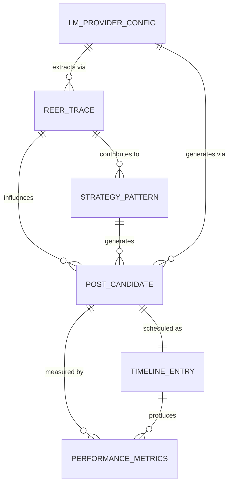

# Data Model: REER × DSPy × MLX Social Posting Pack

**Date**: 2025-01-10  
**Feature**: REER × DSPy × MLX Social Posting Pack  
**Branch**: `001-build-the-reer`

## Entity Definitions

### 1. REER Trace
Append-only record capturing strategy extraction events from historical posts.

**Fields**:
- `id` (string): UUID v4, unique trace identifier
- `timestamp` (datetime): ISO 8601, when trace was created
- `source_post_id` (string): Original post identifier from X
- `seed_params` (object): Parameters that generated this strategy
  - `topic` (string): Content topic/theme
  - `style` (string): Writing style detected
  - `length` (integer): Character count
  - `thread_size` (integer): Number of posts if thread
- `score` (float): Performance score (0.0-1.0)
- `metrics` (object): Performance metrics
  - `impressions` (integer): View count
  - `engagement_rate` (float): Engagement percentage
  - `retweets` (integer): Share count
  - `likes` (integer): Like count
- `strategy_features` (array[string]): Extracted strategy patterns
- `provider` (string): LM provider used for extraction
- `metadata` (object): Additional context
  - `extraction_method` (string): REER method version
  - `confidence` (float): Extraction confidence

**Validation Rules**:
- `id` must be valid UUID v4
- `timestamp` must be valid ISO 8601
- `score` must be between 0.0 and 1.0
- `provider` must match pattern `(mlx|dspy)::.+`

**State**: Immutable after creation (append-only)

### 2. Post Candidate
Generated content awaiting optimization and scheduling.

**Fields**:
- `id` (string): UUID v4, unique candidate identifier
- `created_at` (datetime): ISO 8601, generation timestamp
- `content` (string): Post text content
- `thread_parts` (array[string]): If multi-part thread
- `features` (object): Content characteristics
  - `length` (integer): Character count
  - `hashtags` (array[string]): Hashtags used
  - `mentions` (array[string]): @mentions
  - `links` (array[string]): URLs included
  - `media_type` (string): image/video/none
- `score` (float): Predicted performance (0.0-1.0)
- `scoring_details` (object): Score breakdown
  - `perplexity` (float): Language model perplexity
  - `style_match` (float): Style alignment score
  - `engagement_prediction` (float): Predicted engagement
- `provider` (string): LM provider used for generation
- `trace_ids` (array[string]): Source REER traces used
- `status` (string): draft/scheduled/published/archived

**Validation Rules**:
- `content` max length 280 chars (single) or 25 tweets (thread)
- `score` must be between 0.0 and 1.0
- `status` must be one of: draft, scheduled, published, archived
- `provider` must match pattern `(mlx|dspy)::.+`

**State Transitions**:
- draft → scheduled → published → archived
- draft → archived (rejected)

### 3. Timeline Entry
Scheduled post with publication metadata.

**Fields**:
- `id` (string): UUID v4, unique timeline identifier
- `topic` (string): Content topic/campaign
- `scheduled_time` (datetime): ISO 8601, publication time
- `candidate_id` (string): Associated post candidate
- `drafts` (array[object]): Alternative versions
  - `candidate_id` (string): Alternative candidate
  - `score` (float): Relative score
  - `selected` (boolean): Chosen for publication
- `publication_status` (string): pending/published/failed
- `actual_publish_time` (datetime): When actually published
- `performance` (object): Actual performance (post-publication)
  - `impressions` (integer): 24hr impressions
  - `engagement_rate` (float): 24hr engagement
  - `click_through_rate` (float): Link CTR

**Validation Rules**:
- `scheduled_time` must be future timestamp (on creation)
- `publication_status` must be one of: pending, published, failed
- Only one draft can have `selected: true`

**State Transitions**:
- pending → published (successful post)
- pending → failed (error during posting)

### 4. Strategy Pattern
Reusable posting strategy derived from REER analysis.

**Fields**:
- `id` (string): UUID v4, unique pattern identifier
- `name` (string): Human-readable pattern name
- `pattern_type` (string): Category of strategy
  - thread_storm: Multi-part threads
  - hook_reveal: Hook + revelation format
  - list_format: Numbered/bulleted lists
  - question_driven: Questions to engage
  - story_arc: Narrative structure
- `parameters` (object): Pattern configuration
  - `optimal_length` (object): {min, max, sweet_spot}
  - `optimal_time` (object): {days[], hours[]}
  - `style_markers` (array[string]): Key phrases/patterns
  - `engagement_triggers` (array[string]): Engagement patterns
- `performance_history` (array[object]): Historical performance
  - `date` (datetime): When used
  - `score` (float): Performance score
  - `post_id` (string): Generated post
- `confidence` (float): Pattern reliability (0.0-1.0)
- `trace_count` (integer): Number of traces supporting pattern

**Validation Rules**:
- `pattern_type` must be predefined category
- `confidence` must be between 0.0 and 1.0
- `trace_count` must be >= 3 for activation

### 5. LM Provider Configuration
Settings for routing between providers.

**Fields**:
- `provider_id` (string): Provider identifier
- `provider_type` (string): mlx or dspy
- `model_name` (string): Specific model
- `endpoint` (string): API endpoint (if custom)
- `capabilities` (object):
  - `supports_logprobs` (boolean): Token probabilities
  - `supports_streaming` (boolean): Stream responses
  - `max_context` (integer): Context window size
  - `cost_per_1k_tokens` (float): Pricing
- `rate_limits` (object):
  - `requests_per_minute` (integer)
  - `tokens_per_minute` (integer)
- `priority` (integer): Fallback order (1=highest)
- `enabled` (boolean): Currently active

**Validation Rules**:
- `provider_id` must match pattern `(mlx|dspy)::.+`
- `priority` must be unique per provider_type
- At least one provider must be enabled

### 6. Performance Metrics
KPI measurements for content and strategies.

**Fields**:
- `id` (string): UUID v4, unique metric identifier
- `measurement_date` (datetime): ISO 8601
- `metric_type` (string): Type of measurement
  - impressions_per_follower
  - engagement_rate
  - click_through_rate
  - cost_per_impression
  - perplexity_score
- `value` (float): Metric value
- `baseline` (float): Comparison baseline
- `uplift_percentage` (float): % change from baseline
- `time_window` (string): Measurement period (24h/7d/30d)
- `candidate_ids` (array[string]): Associated posts
- `provider` (string): LM provider used

**Validation Rules**:
- `metric_type` must be predefined type
- `time_window` must be one of: 24h, 7d, 30d
- `uplift_percentage` calculated as ((value-baseline)/baseline)*100

## Relationships



## Storage Implementation

### File Structure
```
data/
├── traces/
│   └── traces.jsonl          # Append-only REER traces
├── candidates/
│   └── candidates.jsonl      # Generated post candidates
├── timelines/
│   └── timelines.jsonl       # Scheduled posts
├── patterns/
│   └── patterns.json         # Strategy patterns (mutable)
├── metrics/
│   └── metrics.jsonl         # Performance metrics
└── config/
    └── providers.json        # LM provider configurations
```

### Access Patterns
- **Traces**: Append-only writes, sequential reads for analysis
- **Candidates**: Append on generation, update status field only
- **Timelines**: Read upcoming, update publication status
- **Patterns**: Read frequently, update performance history
- **Metrics**: Append-only, read for reporting
- **Providers**: Read on startup, rare updates

## Schema Versioning

All schemas include version field:
```json
{
  "$schema": "http://json-schema.org/draft-07/schema#",
  "version": "1.0.0",
  "type": "object",
  ...
}
```

Migration strategy:
1. New version creates new schema file
2. Migration script for existing data
3. Parallel validation during transition
4. Deprecation after migration complete